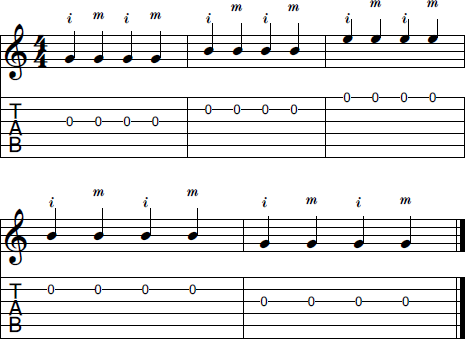
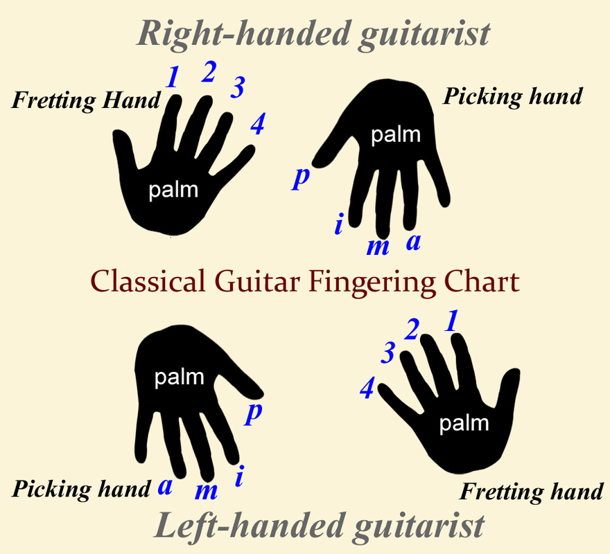
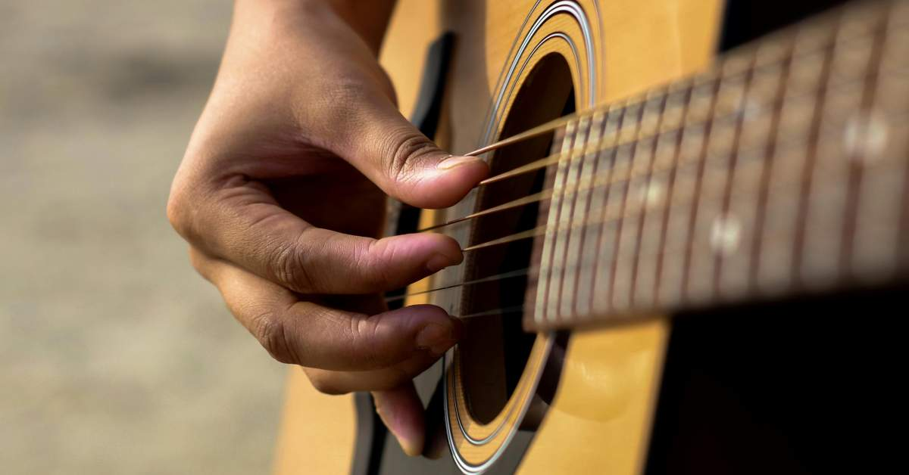
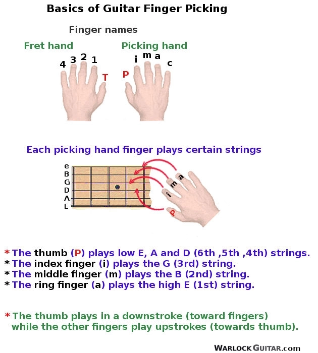
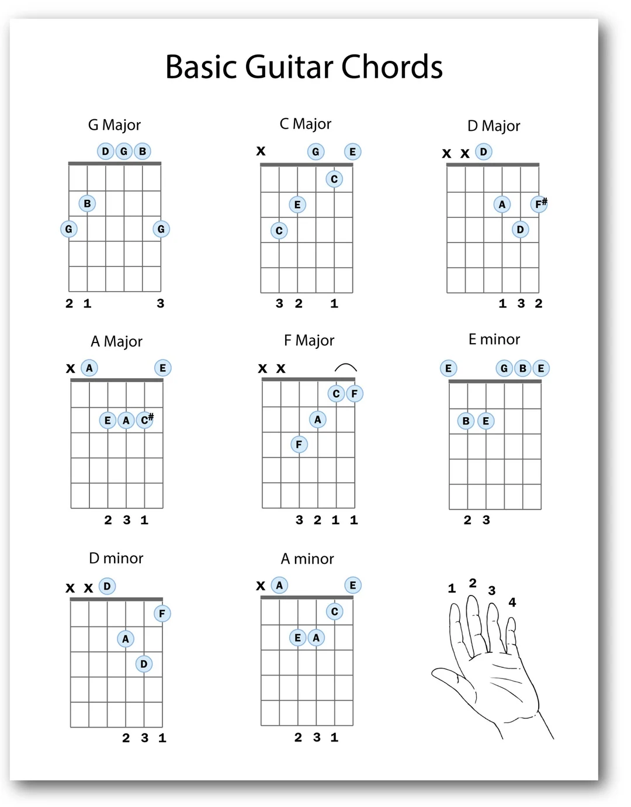

# Guitar








## Fingerstyle Guitar Learning Roadmap

Fingerstyle guitar is a technique where the player plucks the strings directly with the fingers instead of using a pick. It allows the guitarist to play **bass, harmony, and melody simultaneously**, making it possible to perform full arrangements on a single guitar.

### 1. Learn Basic Right-Hand Technique

In classical notation, the right-hand fingers are labeled as:

* **p** – thumb (bass strings: E, A, D)
* **i** – index finger (G string)
* **m** – middle finger (B string)
* **a** – ring finger (high E string)

The thumb usually plays the **bass line**, while the other fingers handle **melody and chords**.

### 2. Practice Basic Fingerstyle Patterns

Start with simple repeating patterns on open chords (C, G, Am, Em). Example pattern:

```
p – i – m – i
```

Play the bass note with the thumb and the higher strings with index and middle fingers. Repeat slowly until the motion becomes natural.

### 3. Learn Alternating Bass (Travis Picking)

A key fingerstyle technique is **alternating bass**, where the thumb moves between two bass strings while the fingers play melody notes. This technique creates a rhythmic and full sound.

Example thumb pattern:

```
Bass 1 → Bass 2 → Bass 1 → Bass 2
```

### 4. Practice With a Metronome

Accuracy is more important than speed in the beginning. Practice patterns slowly with a **metronome** and increase tempo gradually.

### 5. Separate Hand Practice

At first, practice the **right-hand pattern independently** before adding chord changes with the left hand. This helps develop muscle memory.

### 6. Learn Simple Songs

Start with easy fingerstyle arrangements of folk or pop songs. These help combine bass, chords, and melody in a musical context.

### 7. Focus on Dynamics

A good fingerstyle performance emphasizes **bass notes slightly louder than melody notes**. This creates a natural balance similar to piano playing.

### 8. Practice Consistently

Short, regular practice sessions (10–20 minutes daily) are more effective than long but infrequent sessions.

### 9. Study Other Players

Watching experienced fingerstyle guitarists helps in understanding **hand position, finger movement, and tone control**.

### 10. Gradually Learn Full Arrangements

Once the basics are comfortable, start learning complete fingerstyle arrangements where **melody, bass, and rhythm are played together**.

---

Fingerstyle guitar takes patience, but consistent practice will gradually develop coordination and musical independence between the thumb and fingers.





## Fingerstyle Practice – Blowin' in the Wind

Right hand pattern:

p – i – m – i

Thumb plays the bass note, while index and middle play the higher strings.

### Chord Progression (Key of G)

G  →  C  →  G  
G  →  C  →  D  

### Fingerstyle Pattern

For each chord use an alternating bass.

Example (G chord)

Pattern: p – i – m – i  
Strings: 6 – 3 – 2 – 3

```
e|---|
B|-o-|
G|---|
D|---|
A|---|
E|-o-|
```

Example (C chord)

Pattern: p – i – m – i  
Strings: 5 – 3 – 2 – 3

```
e|---|
B|-o-|
G|---|
D|-o-|
A|-o-|
E|---|
```

Example (D chord)

Pattern: p – i – m – i  
Strings: 4 – 3 – 2 – 3

```
e|-o-|
B|-o-|
G|-o-|
D|---|
A|---|
E|---|
```

### Practice Method

1. Play bass with the thumb.
2. Play the upper strings with index and middle.
3. Keep the bass alternating steadily.
4. Practice slowly until the thumb and fingers move independently.

Goal: Bass line steady, melody floating above it.
